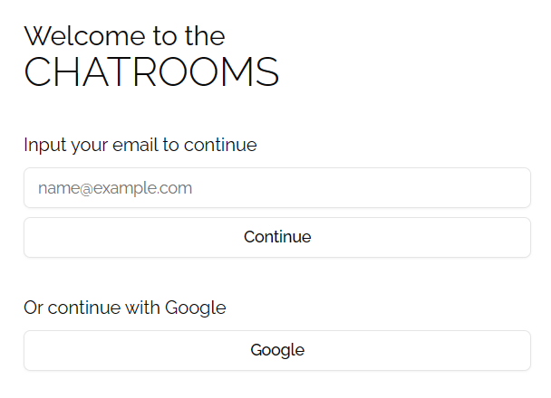
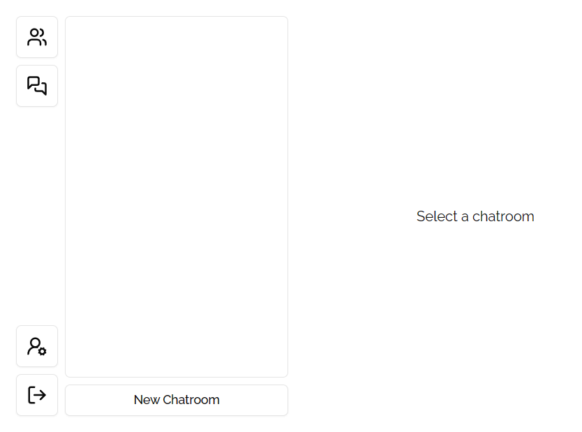
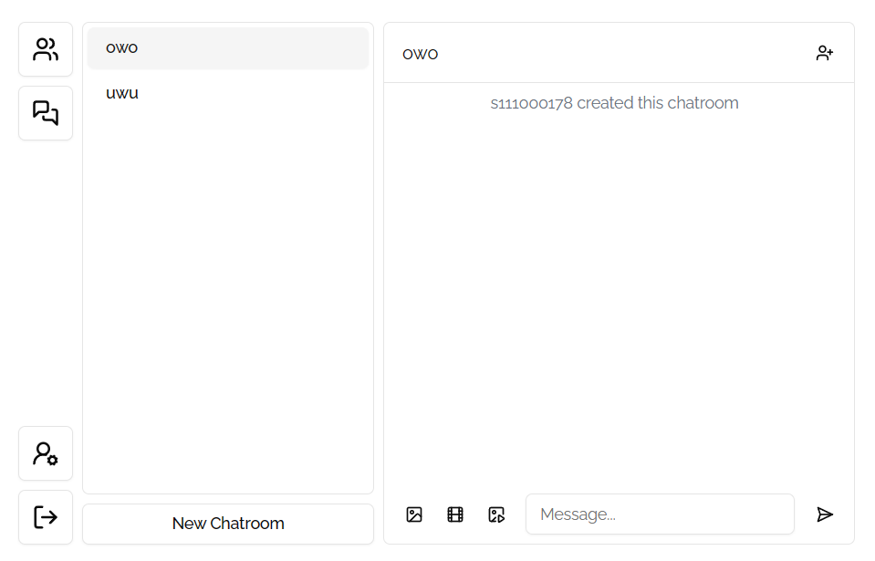

# Software Studio 2023 Spring Midterm Project

### Scoring

| **Basic components**                             | **Score** | **Check** |
| :----------------------------------------------- | :-------: | :-------: |
| Membership Mechanism                             | 15%       | Y         |
| Firebase page                                    | 5%        | Y         |
| Database read/write                              | 15%       | Y         |
| RWD                                              | 15%       | Y         |
| Chatroom                                         | 20%       | Y         |

| **Advanced tools**                               | **Score** | **Check** |
| :----------------------------------------------- | :-------: | :-------: |
| Using React                                      | 10%       | Y         |
| Third-Party Sign In                              | 1%        | Y         |
| Notification                                     | 5%        | N         |
| CSS Animation                                    | 2%        | Y         |
| Security                                         | 2%        | Y         |

| **Other useful functions**                       | **Score** | **Check** |
| :----------------------------------------------- | :-------: | :-------: |
| User Profile                                     | 1%        | Y         |
| Profile Picture                                  | 1%        | Y         |
| Send Image                                       | 1%        | Y         |
| Send Video                                       | 1%        | Y         |
| Chatbot                                          | 2%        | N         |
| Block User                                       | 2%        | N         |
| Unsend Message                                   | 3%        | N         |
| Search For Message                               | 3%        | N         |
| Send GIF From Tenor API                          | 3%        | Y         |


---

### How to setup your project

First, clone the repo, or download the zipped package

```bash
git clone https://github.com/Joshimello/Chatroom
cd Chatroom
```

Run the following command to install the dependencies

```bash
npm i
```

Finally, you can start the development server

```bash
npm run dev
```

Optionally, you may build the SPA with

```bash
npm run build
```

### How to use 

In the initial authentication page, you will be prompted a new password if a new email is entered, or prompted for password if the email has already registered. Alternatively, you may use Google to login.



After logging in, from the sidebar, you may see all users, all chatrooms, and your own account settings. There will be no chatrooms initially, you may create one with the New Chatroom button. You may logout anytime with the logout button as well.



You can select people to add into the chatroom. You may send texts, images, videos, and tenor gifs.
New joins will be announced after inviting.



### Function description

1. Authentication
    - Sign up with email and password
    - Sign in with email and password
    - Sign in with Google OAuth
    - Sign out

2. Main Platform
    - Users list
    - Chatrooms
        - Create chatrooms
        - Add users to chatroom from list
        - Send text
        - Send image
        - Send video
        - Send Tenor gif

### Firebase page link

[chatroom-111000178.web.app](https://chatroom-111000178.web.app)

### Others (Optional)

Randomly occuring Firebase issue, where users are unable to create rooms after account creation. Simple fix by reloading.

<style>
table th{
    width: 100%;
}
</style>